# APPLICATION_FLOW.md — Aevnum

> ⚠️ This documentation must always reflect the current implementation. Whenever related code is added, removed, or modified, this document must be updated in the same pull request.

---

## Project Purpose

Aevnum is a **free social media video downloader**. Its business model is ad-supported: users get unlimited downloads in exchange for viewing an interstitial advertisement for a fixed countdown period before each download is granted. The frontend never exposes raw CDN URLs — all media access is gated through short-lived `streamToken`s issued by the backend.

---

## Complete User Journey

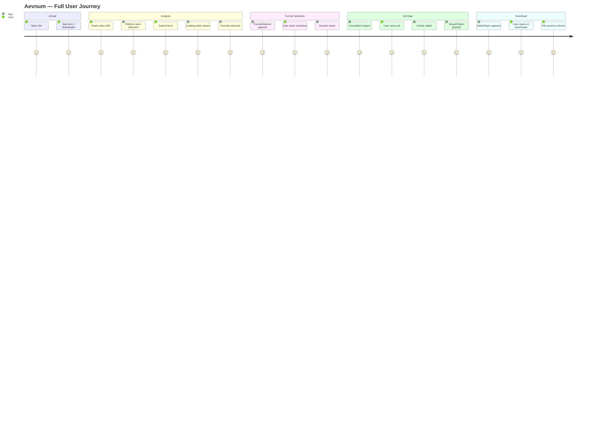

---

## Application Flow (Full Detail)

### 1. Page Load Flow

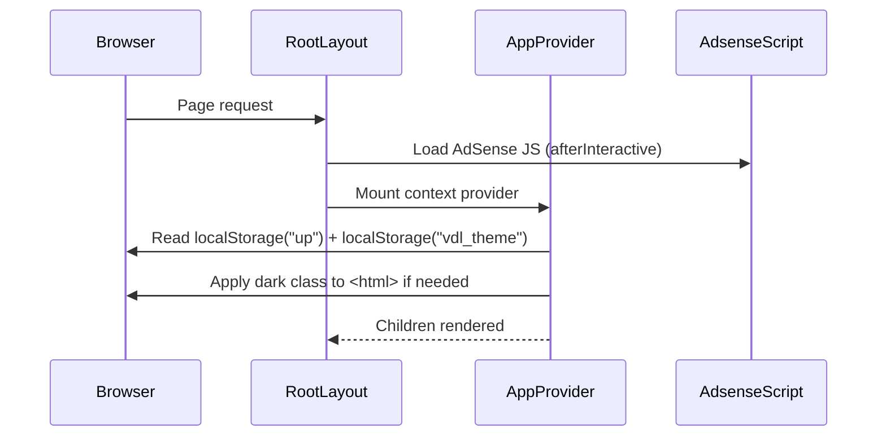

**Key files**: [`app/layout.tsx`](../app/layout.tsx), [`context/AppContext.tsx`](../context/AppContext.tsx), [`components/ui/ad-Script.tsx`](../components/ui/ad-Script.tsx)

---

### 2. URL Analysis Flow

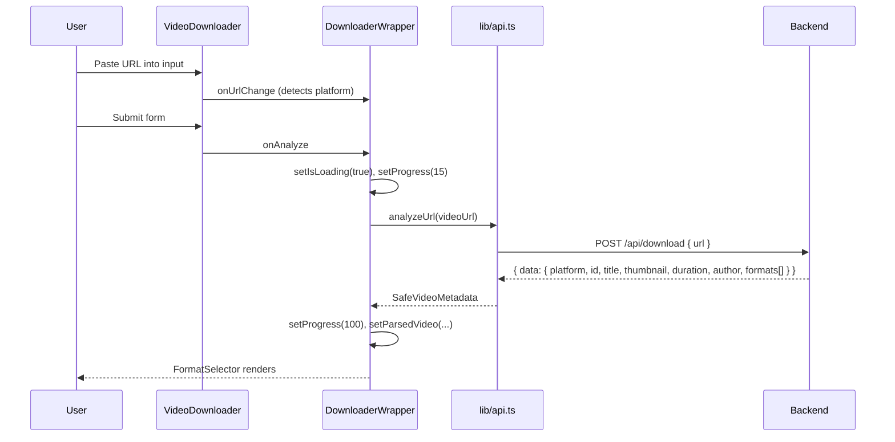

**Platform detection logic** (in `DownloaderWrapper`):
- URL contains `instagram.com` → `instagram`
- URL contains `tiktok.com` → `tiktok`
- URL contains `youtube.com` or `youtu.be` → `youtube`
- URL contains `facebook.com` or `fb.watch` → `facebook`
- Fallback: fuzzy keyword match (`insta`, `tik`/`tok`, `you`/`yt`, `face`/`fb`)

---

### 3. Session Flow (Ad Gate)

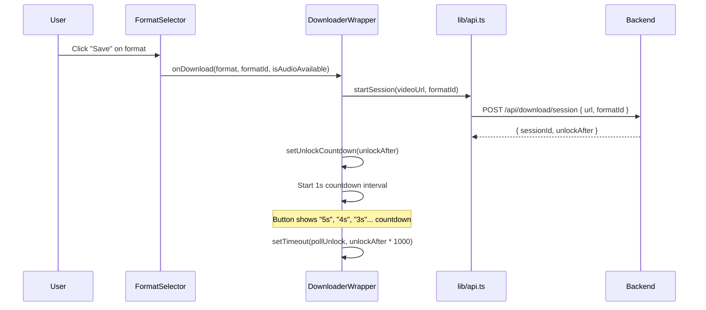

---

### 4. Unlock Flow (Poll Until Token)

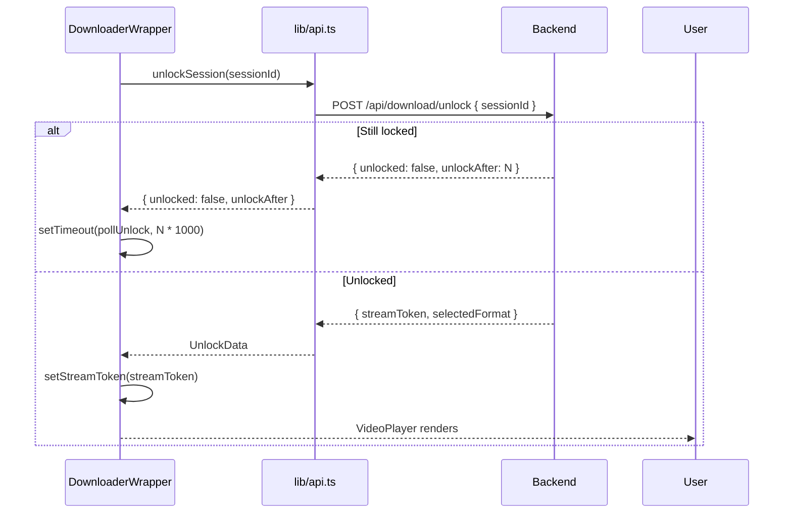

**Important**: The backend returns `{ unlocked: false, unlockAfter }` when the timer hasn't expired yet. The frontend polls recursively with the server-provided wait time. This handles clock drift between client and server.

---

### 5. Download Flow

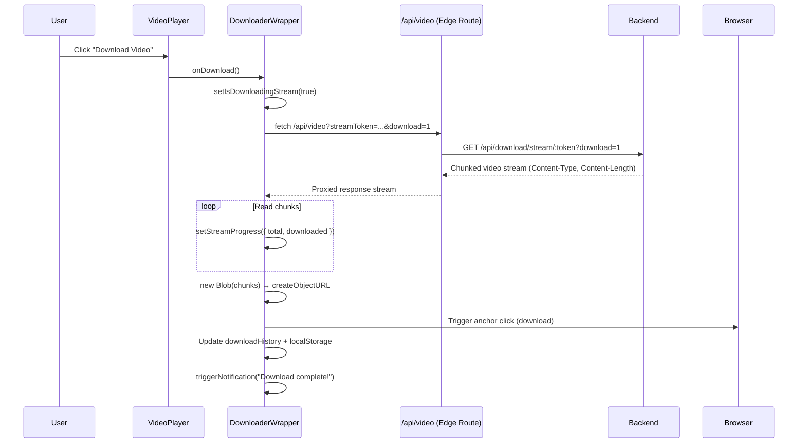

---

### 6. Stream (Preview) Flow

The "Open in New Tab" button opens:
```
/api/video?streamToken=<token>
```
without `&download=1`. The Edge route sets `Content-Disposition: inline`, and the browser's native video player or OS handler takes over.

---

### 7. Error Flow

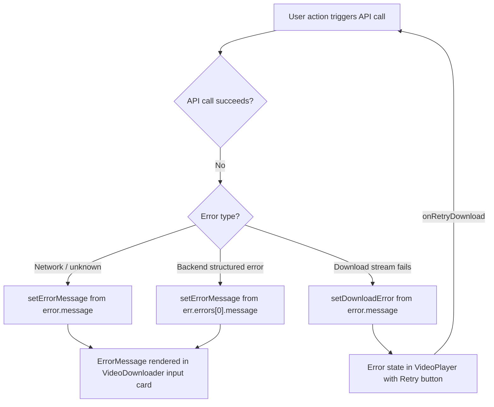

---

### 8. Loading Flow

| Component | Loading state | UI representation |
|-----------|--------------|-------------------|
| `VideoDownloader` | `isLoading = true` | Spinner on submit button + progress bar (0→100%) |
| `FormatSelector` button | `loadingFormatId = formatId` | Spinner + countdown seconds (`5s`, `4s`...) |
| `VideoPlayer` | `isDownloading = true, !streamProgress` | "Starting download..." spinner panel |
| `VideoPlayer` | `isDownloading = true, streamProgress` | Green progress bar with bytes/percentage |

---

### 9. History Flow

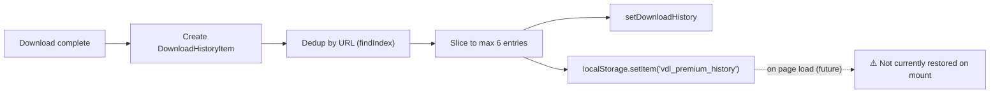

> ⚠️ **Needs Verification**: The download history is written to `localStorage` (`vdl_premium_history`) on every download, but is **not restored from localStorage on page load**. The state starts empty on each session. This is likely intentional (session-only history) or a pending feature.

---

### 10. Cookie / Storage Flow

```mermaid
flowchart TD
    Mount[AppProvider mounts] --> ReadUP["Read localStorage('up')"]
    ReadUP -- "not set" --> ReadDevice["window.matchMedia('prefers-color-scheme')"]
    ReadUP -- "set to '1'" --> ReadTheme["Read localStorage('vdl_theme')"]
    ReadDevice --> ApplyTheme[setTheme(dark or light)]
    ReadTheme --> ApplyTheme
    ApplyTheme --> ClassSync["useEffect: toggle 'dark' class on html element"]

    Toggle[User clicks ThemeToggle] --> ToggleFn[toggleTheme()]
    ToggleFn --> WriteUP["localStorage.setItem('up', '1')"]
    ToggleFn --> WriteTheme["localStorage.setItem('vdl_theme', nextTheme)"]
    ToggleFn --> ClassSync
```

| Key | Type | Value | Purpose |
|-----|------|-------|---------|
| `up` | localStorage | `"1"` | Whether user has explicitly chosen a theme |
| `vdl_theme` | localStorage | `"light"` or `"dark"` | Stored theme preference |
| `vdl_premium_history` | localStorage | JSON array | Recent download history |
| `aether_resume_downloads` | localStorage | JSON array | Resume entries (from `download-manager.ts`) |

---

### 11. Theme Flow

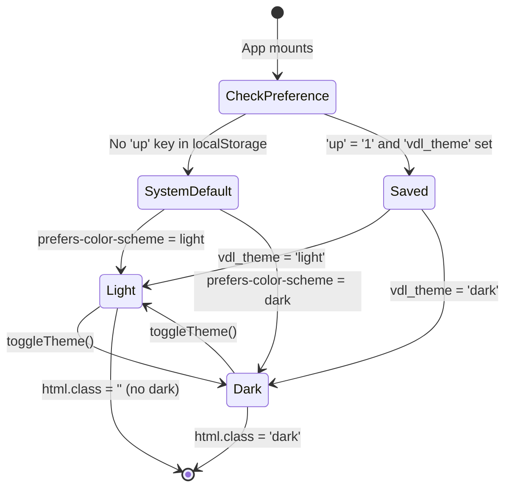

---

### 12. Ad Flow

The ad system operates on three layers simultaneously:

1. **Header banner** (Leaderboard): `AdBanner` → `AdSenseSlot` at the top of the downloader section, always visible.
2. **Sidebar ad**: `AdSenseSlot` in the 4-column sidebar, always visible when `parsedVideo = null`.
3. **Sticky bottom anchor**: Fixed bar at `bottom-0`. Dismissible by user. Controls via `useBottomAd()` context hook. Footer adds `mb-20` padding when visible.

**Ad script injection**: Two mechanisms exist (the second duplicates the first):
- `app/layout.tsx` → `AdsenseScript` component (via `next/script` with `afterInteractive`)
- `downloader-wrapper.tsx` → Manual `document.createElement('script')` on mount

> ⚠️ The double AdSense script injection is a potential issue: the manual script in `DownloaderWrapper` removes any existing `pagead2.googlesyndication.com` script and re-adds it whenever `adsenseClientId` changes. This could cause ad reloads.

---

### 13. API Request Lifecycle

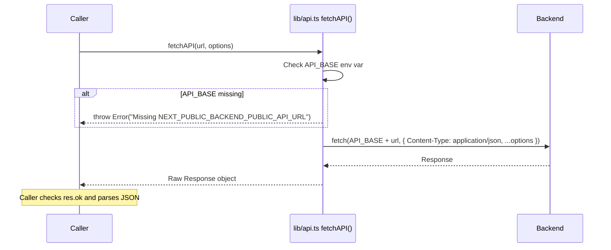

All API calls go through `fetchAPI()` which:
- Validates `NEXT_PUBLIC_BACKEND_PUBLIC_API_URL` is set
- Sets `Content-Type: application/json` automatically
- Returns the raw `Response` (callers handle `.ok` checks and `.json()` parsing)

---

### 14. State Transitions (DownloaderWrapper)

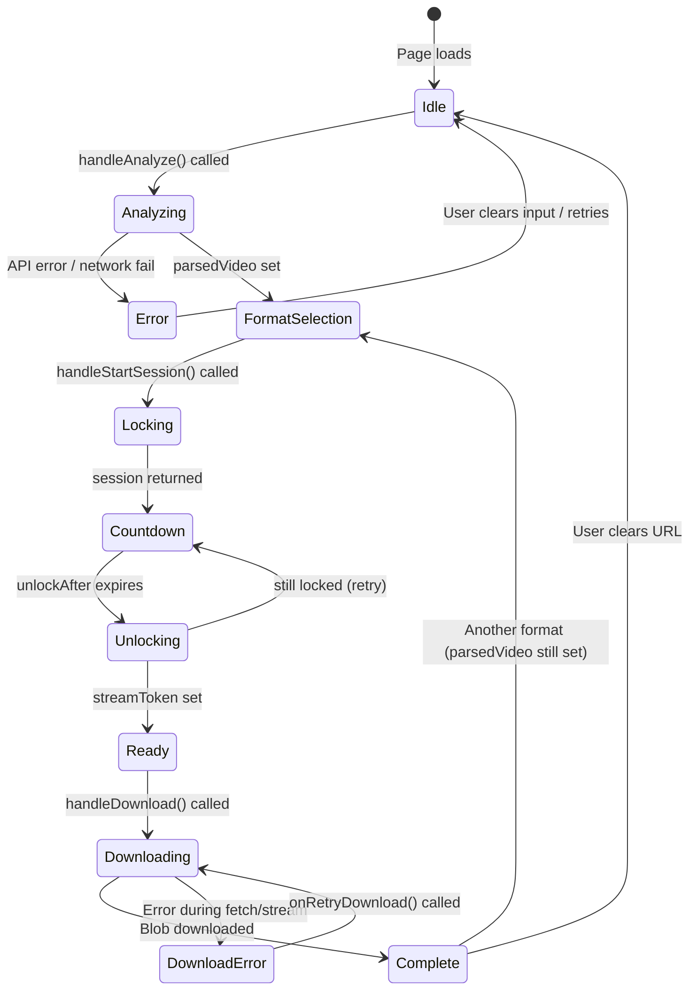

*Related files: [`components/sections/downloader-wrapper.tsx`](../components/sections/downloader-wrapper.tsx), [`lib/api.ts`](../lib/api.ts), [`context/AppContext.tsx`](../context/AppContext.tsx)*
