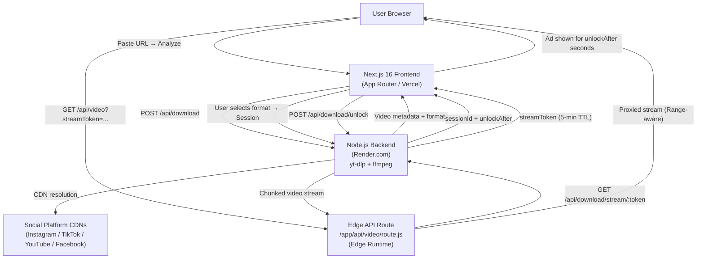
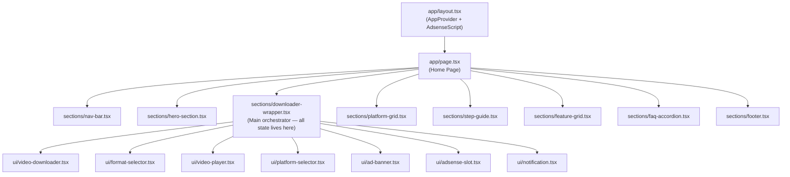
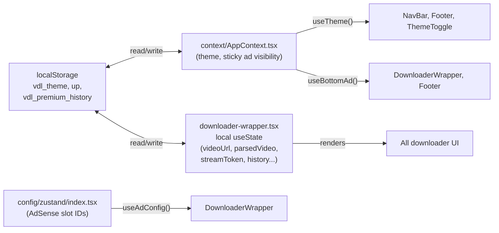

# APP_ARCHITECTURE.md — Aether Downloader

> ⚠️ This documentation must always reflect the current implementation. Whenever related code is added, removed, or modified, this document must be updated in the same pull request.

---

## System Overview

Aether Downloader is a **Next.js 16 App Router** application paired with an **external Node.js backend**. The frontend acts as a thin orchestration layer: it accepts URLs from the user, calls the backend API to resolve CDN stream tokens, and then streams the media file directly from the backend to the user's browser.

No video data is ever stored on the frontend server. All media resolution happens transiently on the backend (hosted on Render.com).

---

## Architecture Layers

---

## Component Architecture

---

## State Architecture

---

## Data Flow Summary

### Analyze Flow
1. User pastes URL → `handleUrlChange` detects platform
2. Form submit → `handleAnalyze` → `analyzeUrl()` in `lib/api.ts`
3. `POST /api/download` → backend returns metadata + formats
4. `parsedVideo` state set → `FormatSelector` renders

### Session/Unlock Flow
1. User clicks "Save" on a format → `handleStartSession`
2. `POST /api/download/session` → returns `{ sessionId, unlockAfter }`
3. Countdown timer starts; ad is shown simultaneously
4. After `unlockAfter` seconds → `POST /api/download/unlock`
5. If locked, response contains `{ unlocked: false, unlockAfter }` → retry
6. If unlocked → `{ streamToken }` is set in state

### Stream/Download Flow
1. `streamToken` in state → `VideoPlayer` renders
2. "Open in New Tab" → opens `/api/video?streamToken=...`
3. "Download" → fetches `/api/video?streamToken=...&download=1`
4. Edge route proxies request to backend stream endpoint
5. Bytes streamed to browser → `Blob` created → anchor tag clicked

---

## Key Design Principles

| Principle | Implementation |
|-----------|---------------|
| Stateless media | Backend resolves CDN URLs on-demand; no file storage |
| Privacy-first | No server-side user profiles; history lives in browser |
| Ad-monetized unlock | Session gate enforces ad view before token release |
| Edge proxying | `/app/api/video/route.js` on edge for low-latency streaming |
| No login required | Fully anonymous, no authentication layer |

---

## External Dependencies

| Service | Purpose | Config |
|---------|---------|--------|
| Render.com (Node.js) | Backend API host | `NEXT_PUBLIC_BACKEND_PUBLIC_API_URL` |
| Google AdSense | Ad revenue | `NEXT_PUBLIC_ADSENSE_CLIENT_ID` |
| Vercel (assumed) | Frontend deploy | N/A |

*Related files: [`app/layout.tsx`](../app/layout.tsx), [`app/page.tsx`](../app/page.tsx), [`context/AppContext.tsx`](../context/AppContext.tsx), [`config/zustand/index.tsx`](../config/zustand/index.tsx), [`lib/api.ts`](../lib/api.ts)*
