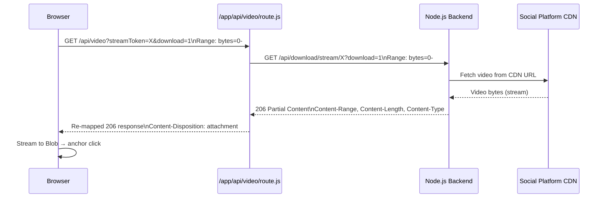

# BACKEND_INTEGRATION.md — Aether Downloader

> ⚠️ This documentation must always reflect the current implementation. Whenever related code is added, removed, or modified, this document must be updated in the same pull request.

---

## Backend Architecture

The frontend communicates with an **external Node.js backend** hosted on Render.com. The backend uses **yt-dlp** to resolve video metadata and CDN stream URLs, and **ffmpeg** for audio merging when formats are video-only.

**Production URL**: `https://aether-backend-exrn.onrender.com`  
**Dev URL**: `http://localhost:3000` (commented out in `.env`)  
**Config key**: `NEXT_PUBLIC_BACKEND_PUBLIC_API_URL`

The frontend **never** receives or exposes raw CDN URLs. All media access is mediated through short-lived `streamToken`s.

---

## Frontend HTTP Client

**File**: [`lib/api.ts`](../lib/api.ts)

```typescript
const API_BASE = process.env.NEXT_PUBLIC_BACKEND_PUBLIC_API_URL;
```

All requests go through the `fetchAPI()` wrapper:

```typescript
export async function fetchAPI(url: string, options?: RequestInit): Promise<Response>
```

- Validates `API_BASE` is defined; throws if not
- Merges `Content-Type: application/json` with caller headers
- Returns the raw `Response` for callers to inspect

---

## API Endpoints

### 1. Analyze URL — `POST /api/download`

**Called by**: `analyzeUrl()` in `lib/api.ts`  
**Triggered by**: `handleAnalyze()` in `DownloaderWrapper`

**Request**:
```json
{
  "url": "https://www.tiktok.com/@user/video/123456789"
}
```

**Success Response (200)**:
```json
{
  "success": true,
  "data": {
    "platform": "tiktok",
    "id": "123456789",
    "title": "Video Title",
    "thumbnail": "https://...",
    "duration": 30,
    "author": "@user",
    "formats": [
      {
        "formatId": "0",
        "ext": "mp4",
        "resolution": "720x1280",
        "filesize": 5242880,
        "quality": "720p",
        "isAudioAvailable": true
      }
    ]
  }
}
```

**Error Response**:
```json
{
  "errors": [{ "message": "Unsupported content delivery infrastructure destination requested." }]
}
```

**Frontend handling**: Error extracted from `err.errors[0].message`, falling back to HTTP status code.

---

### 2. Start Session — `POST /api/download/session`

**Called by**: `startSession()` in `lib/api.ts`  
**Triggered by**: `handleStartSession()` in `DownloaderWrapper` when user clicks "Save"

**Request**:
```json
{
  "url": "https://www.tiktok.com/@user/video/123456789",
  "formatId": "0"
}
```

**Response (200)**:
```json
{
  "sessionId": "550e8400-e29b-41d4-a716-446655440000",
  "unlockAfter": 5
}
```

| Field | Description |
|-------|-------------|
| `sessionId` | UUID identifying this session, used in the unlock call |
| `unlockAfter` | Seconds the frontend must wait before calling unlock |

**Session properties**:
- Session expires after **15 minutes** of inactivity
- Locked to the specific `formatId` passed at creation
- `unlockAfter` = controlled ad delay timer

---

### 3. Unlock Session — `POST /api/download/unlock`

**Called by**: `unlockSession()` in `lib/api.ts`  
**Triggered by**: `pollUnlock()` in `DownloaderWrapper` after the initial wait

**Request**:
```json
{
  "sessionId": "550e8400-e29b-41d4-a716-446655440000"
}
```

**Success Response (200)**:
```json
{
  "success": true,
  "data": {
    "selectedFormat": {
      "formatId": "0",
      "ext": "mp4",
      "resolution": "720x1280",
      "filesize": 5242880,
      "quality": "720p",
      "isAudioAvailable": true
    },
    "streamToken": "a1b2c3d4-e5f6-7890-abcd-ef1234567890"
  }
}
```

**Still-Locked Response (200 with `unlocked: false`)**:
```json
{
  "unlocked": false,
  "unlockAfter": 3.2
}
```

> The frontend checks `"unlocked" in result` to distinguish the still-locked case. On `unlocked: false`, it waits `Math.max(result.unlockAfter, 1)` seconds and retries.

**`streamToken` properties**:
- Expires after **5 minutes**
- Single use pattern — the user should download immediately
- The browser **never** sees the original CDN URL

---

### 4. Stream Video — `GET /api/download/stream/:token`

**Proxied through**: [`app/api/video/route.js`](../app/api/video/route.js) (Edge Runtime)  
**Called by**: `getStreamUrl()` in `lib/api.ts`

**Frontend URL format**:
```
/api/video?streamToken=<token>           # inline playback
/api/video?streamToken=<token>&download=1 # file download
```

The Edge route:
1. Extracts `streamToken` and `download` from query params
2. Extracts `Range` header from the browser request (for video seeking)
3. Proxies to `${BACKEND_URL}/api/download/stream/${streamToken}`
4. Re-maps `Content-Range`, `Accept-Ranges`, `Content-Length`, `Content-Type`
5. Sets `Content-Disposition: attachment` if `?download=1`, else `inline`
6. Returns `206 Partial Content` for range requests, `200` otherwise

**Error Responses**:
- `400`: Missing `streamToken` parameter
- `502`: Backend returned non-2xx
- `404` (from backend): Token expired or not found

---

### 5. Format Download — `POST /api/download/format`

**Called by**: `downloadFormat()` in `lib/api.ts`  
**Used in**: Available but not currently called from the UI (the session/stream flow is used instead)

**Request**:
```json
{
  "url": "https://www.tiktok.com/@user/video/123456789",
  "formatId": "0",
  "isAudioAvailable": false
}
```

**Response**: Binary stream  

| Header | Value |
|--------|-------|
| `Content-Type` | `video/mp4` |
| `Content-Disposition` | `attachment; filename="aether_0.mp4"` |
| `X-Audio-Merged` | `true`/`false` |

> When `isAudioAvailable = false`, the backend merges audio via ffmpeg server-side.

---

### 6. Download Manager Endpoints (lib/download-manager.ts)

These endpoints are defined in `lib/download-manager.ts` and support an **alternative chunked download flow** with SSE progress. They are implemented but not currently wired to any active UI flow.

#### Init Download — `POST /api/download/format/init`

```typescript
const res = await fetch(`${NEXT_BACKEND_PUBLIC_API_URL}/api/download/format/init`, {
  method: "POST",
  body: JSON.stringify({ url, formatId, isAudioAvailable }),
});
// Returns: { data: { downloadId: string } }
```

#### Progress via SSE — `GET /api/download/format/progress/:downloadId`

Uses `EventSource` to receive real-time progress events:

```typescript
const source = new EventSource(url);
source.onmessage = (event) => {
  const data: DownloadProgress = JSON.parse(event.data);
  // status: "queued" | "downloading" | "completed" | "error"
  // percent, speed, eta, totalSize, downloadedBytes
};
```

Timeout: 5 minutes. On `source.onerror`, polls status endpoint after 3 seconds.

#### Status Check — `GET /api/download/format/status/:downloadId`

Fallback polling when SSE disconnects.

#### File Download — `GET /api/download/format/file/:downloadId`

Streams completed file with `Range` header support (for resume). Reads `Content-Range` and `Content-Length` for progress tracking.

> ⚠️ **Note**: `lib/download-manager.ts` uses `NEXT_BACKEND_PUBLIC_API_URL` (without `PUBLIC_`) for `API_BASE`, while `lib/api.ts` uses `NEXT_PUBLIC_BACKEND_PUBLIC_API_URL`. These must be kept in sync.

---

## All Backend Endpoints Summary

| Method | Path | Purpose | Frontend Function |
|--------|------|---------|-------------------|
| `POST` | `/api/download` | Analyze URL, return formats | `analyzeUrl()` |
| `POST` | `/api/download/session` | Start session with ad gate | `startSession()` |
| `POST` | `/api/download/unlock` | Unlock session after wait | `unlockSession()` |
| `GET` | `/api/download/stream/:token` | Stream video by token | Edge proxy route |
| `POST` | `/api/download/format` | Server-side format DL with merge | `downloadFormat()` |
| `POST` | `/api/download/format/init` | Init chunked download (SSE flow) | `initDownload()` |
| `GET` | `/api/download/format/progress/:id` | SSE progress stream | `waitForDownload()` |
| `GET` | `/api/download/format/status/:id` | Status fallback poll | internal |
| `GET` | `/api/download/format/file/:id` | Fetch completed file | `downloadFile()` |
| `GET` | `/health` | Health check | not used from UI |

---

## HTTP Status Code Reference

| Status | Meaning | Frontend handling |
|--------|---------|-----------------|
| `200` | Success | Parse JSON, update state |
| `206` | Partial Content (range) | Used for video seeking in Edge proxy |
| `400` | Bad Request | Display error message |
| `403` | Session not yet unlocked | Wait `unlockAfter` seconds, retry |
| `404` | Token/session expired | Show error, user must restart |
| `429` | Rate limited (20 req/min/IP) | Show error |
| `500` | Server error (yt-dlp/ffmpeg) | Show error |
| `502` | Bad gateway (CDN unreachable) | Show error |
| `504` | Gateway timeout | Show error |

---

## Data Models

### FormatItem
```typescript
interface FormatItem {
  formatId: string;         // yt-dlp format identifier
  ext: string;              // "mp4", "webm", etc.
  resolution: string;       // "720x1280", "1920x1080", etc.
  filesize?: number;        // bytes (may be undefined)
  quality?: string;         // "720p", "1080p", etc.
  isAudioAvailable: boolean; // false = video-only track
}
```

### SafeVideoMetadata
```typescript
interface SafeVideoMetadata {
  data?: {
    platform: string;       // "instagram" | "tiktok" | "youtube" | "facebook"
    id: string;             // platform-native video ID
    title: string;
    thumbnail: string;      // CDN URL for preview image
    duration: number;       // seconds
    author: string;         // "@username"
    formats: FormatItem[];
  };
  error?: string;
}
```

### SessionResponse
```typescript
interface SessionResponse {
  sessionId: string;        // UUID
  unlockAfter: number;      // seconds to wait
}
```

### UnlockData
```typescript
export interface UnlockData {
  selectedFormat: FormatItem;
  streamToken: string;      // UUID, expires in 5 minutes
}
```

### DownloadProgress (SSE)
```typescript
export interface DownloadProgress {
  downloadId: string;
  status: "queued" | "downloading" | "completed" | "error";
  percent: number;          // 0–100
  speed: string;            // e.g. "2.50 MiB/s"
  eta: string;              // e.g. "00:11"
  totalSize: number;        // bytes
  downloadedBytes: number;
  error?: string;
  mimeType?: string;
}
```

---

## Video Streaming Architecture



**Why Edge Runtime?** The edge runtime allows the streaming proxy to run without Node.js-specific APIs while supporting range request passthrough for browser video seeking. The `export const runtime = "edge"` declaration in `route.js` enables this.

---

## Cache Behavior

- **No caching on frontend**: All requests use the default fetch behavior (no explicit `cache: "no-store"` in `lib/api.ts`).
- **Edge route**: `cache: "no-store"` is set on the backend fetch call in `/api/video/route.js` to ensure fresh streams.
- **Resume state**: The `download-manager.ts` stores partial download progress in localStorage under `aether_resume_downloads` for future resume capability.

---

## Retry Mechanism

| Scenario | Retry behavior |
|----------|---------------|
| Session still locked (403) | Wait `unlockAfter` seconds, call `pollUnlock` again recursively |
| Download stream error | User manually clicks "Try Again" → `onRetryDownload` |
| SSE connection lost | `EventSource.onerror` → poll status endpoint after 3s; reconnects automatically |
| SSE timeout | 5-minute timeout → `done(new Error("Download timed out"))` |

*Related files: [`lib/api.ts`](../lib/api.ts), [`lib/download-manager.ts`](../lib/download-manager.ts), [`app/api/video/route.js`](../app/api/video/route.js)*
