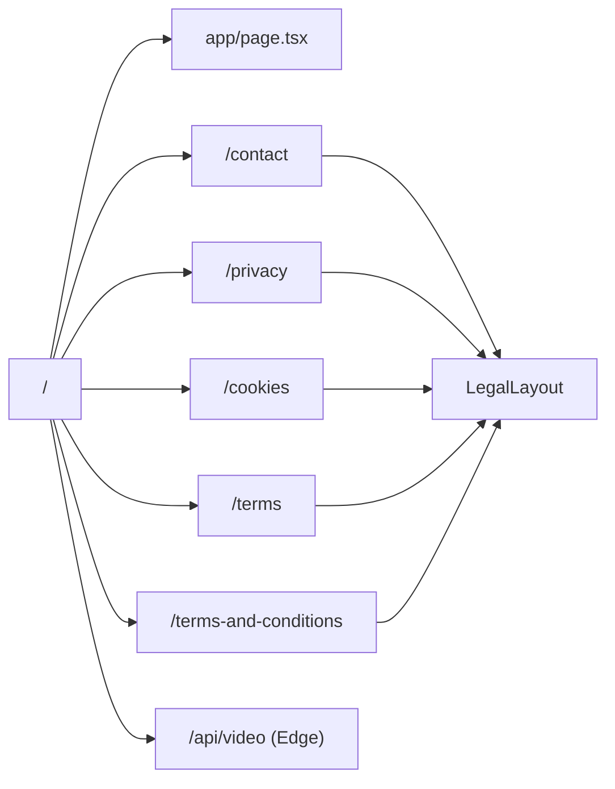

# ROUTES.md — Aether Downloader

> ⚠️ This documentation must always reflect the current implementation. Whenever related code is added, removed, or modified, this document must be updated in the same pull request.

---

## Routing System

Aether uses **Next.js 16 App Router**. All routes are defined by folder structure under `app/`. Page components export `metadata` objects for SEO. The only API route is the edge streaming proxy.

---

## Route Map



---

## Page Routes

### `/` — Home Page

**File**: [`app/page.tsx`](../app/page.tsx)  
**Type**: Server Component (Next.js RSC)  
**Access**: Public

**Metadata**:
```typescript
export const metadata = {
  title: "Aether Downloader | Free Social Media Video Downloader",
  description: "Extract uncompressed source media streams directly from Instagram, TikTok, YouTube, and Facebook. Zero compression, high speed.",
};
```

**SEO Target**: Primary landing page — targets "free social media video downloader", "Instagram downloader", "TikTok downloader", "YouTube downloader", "Facebook video downloader".

**Components rendered (in order)**:
1. `NavBar` — sticky header
2. Background decorative gradient div
3. Moving blob background glow (`mooving_blob`)
4. `HeroSection` — landing headline
5. `DownloaderWrapper` — (within `#downloader-section`)
6. `PlatformGrid` — (with `#platform-grid` ID)
7. `StepGuide` — (with `#step-guide` ID)
8. `FeatureGrid`
9. `FAQAccordion` — (with `#faq-accordion` ID)
10. `Footer`

**Navigation**: Internal anchor links from NavBar (`#downloader-section`, `#platform-grid`, `#step-guide`, `#faq-accordion`)

---

### `/contact` — Contact Page

**File**: [`app/contact/page.tsx`](../app/contact/page.tsx)  
**Type**: Client Component  
**Access**: Public

**Metadata**: None defined (inherits root layout metadata — "Create Next App")  
> ⚠️ Missing `export const metadata` — should be added for SEO.

**Components rendered**: `LegalLayout` wrapping a contact form

**Form fields**: Full Name, Email Address, Message  
**Submission**: Client-side only — no API call. Form sets `submitted = true` on valid input.  
> ⚠️ Contact form is purely UI — messages are **not actually sent** anywhere.

**Use cases**: API access licenses, DMCA notifications, operational errors, ad placement adjustments.

---

### `/privacy` — Privacy Policy

**File**: [`app/privacy/page.tsx`](../app/privacy/page.tsx)  
**Type**: Server Component  
**Access**: Public

**Metadata**:
```typescript
export const metadata = {
  title: "Privacy Policy | Aether Downloader",
  description: "Privacy Policy for Aether Downloader, explaining our stateless processing and third-party advertising cookies.",
};
```

**Content sections**:
1. Zero-Retention & Stateless Privacy
2. Personal Identifiable Information (PII)
3. Server Logs & Rate Limiting
4. Google AdSense & Third-Party Cookies
5. Client Storage Preferences (localStorage keys documented)

**Last Updated**: July 7, 2026

---

### `/cookies` — Cookie Policy

**File**: [`app/cookies/page.tsx`](../app/cookies/page.tsx)  
**Type**: Server Component  
**Access**: Public

**Metadata**:
```typescript
export const metadata = {
  title: "Cookie Policy | Aether Downloader",
  description: "Cookie Policy and settings matrix for Aether Downloader service, explaining how advertising and preference cookies are handled.",
};
```

**Content sections**:
1. Understanding Cookies & Web Storage
2. Classification of Cookies Used
3. Detailed Storage/Cookie Matrix (table)
4. Managing Consent & Disabling Cookies

**Cookie Matrix** (as documented in the page):

| Key | Provider | Duration | Purpose |
|-----|---------|---------|---------|
| `vdl_theme` | Aether (Local) | Persistent | Dark/light mode preference |
| `vdl_premium_history` | Aether (Local) | Persistent | Recent download history |
| `__gads` / `__gac` | Google AdSense | 13 Months | Personalized advertising |
| `IDE` / `DSID` | DoubleClick (Google) | 1 Year | Ad conversion tracking |

**Last Updated**: July 7, 2026

---

### `/terms` — Terms of Service (Current)

**File**: [`app/terms/page.tsx`](../app/terms/page.tsx)  
**Type**: Server Component  
**Access**: Public

**Metadata**:
```typescript
export const metadata = {
  title: "Terms of Service | Aether Downloader",
  description: "Terms and conditions of using Aether Downloader stateless extraction service.",
};
```

**Content sections**:
1. Agreement to Terms
2. Scope of Service
3. Stateless Processing and Zero Hosting
4. Intellectual Property & Fair Compliance
5. Limitation of Liability

**Last Updated**: July 7, 2026

---

### `/terms-and-conditions` — Terms of Service (Legacy)

**File**: [`app/terms-and-conditions/page.tsx`](../app/terms-and-conditions/page.tsx)  
**Type**: Server Component  
**Access**: Public

**Metadata**: None  
**Status**: Older, shorter version. Appears to be a legacy route from a previous domain (`downloadreels.site`).  

> ⚠️ This route is likely kept for backward compatibility but `/terms` is the canonical route. Consider adding a redirect from `/terms-and-conditions` → `/terms`.

---

## API Routes

### `GET /api/video` — Video Stream Proxy

**File**: [`app/api/video/route.js`](../app/api/video/route.js)  
**Runtime**: Edge  
**Access**: Public (requires valid `streamToken`)

**Query Parameters**:

| Parameter | Required | Description |
|-----------|---------|-------------|
| `streamToken` | Yes | UUID from unlock response |
| `download` | No | Set to `"1"` for file download mode |

**Request Headers forwarded**: `Range` (for video seeking)

**Response Headers set**:

| Header | Value |
|--------|-------|
| `Content-Range` | Passed from backend |
| `Accept-Ranges` | `bytes` |
| `Content-Length` | Passed from backend |
| `Content-Type` | Passed from backend (defaults to `video/mp4`) |
| `Content-Disposition` | `attachment; filename="video.mp4"` (if `?download=1`) or `inline` |

**Error Responses**:
- `400` with `{ error: "Missing streamToken" }`: No token provided
- `502` with `{ error: "Internal Gateway Error" }`: Backend unreachable or error

**Purpose**: Proxies video streams from the Node.js backend. The edge runtime handles chunked streaming efficiently without buffering. Prevents the browser from ever seeing the raw CDN URL.

---

## Navigation Structure

### NavBar Links (Desktop only — `hidden md:flex`)

| Label | Target | Type |
|-------|-------|------|
| PARSER | `#downloader-section` | Anchor |
| COMPATIBILITY | `#platform-grid` | Anchor |
| WORKFLOW | `#step-guide` | Anchor |
| FAQS | `#faq-accordion` | Anchor |

### Footer Links

| Label | Target | Type |
|-------|-------|------|
| TERMS & SERVICE | `/terms` | Page route |
| PRIVACY SETTINGS | `/privacy` | Page route |
| COOKIE MATRIX | `/cookies` | Page route |
| CONTACT WEBMASTER | `/contact` | Page route |

### LegalLayout Back Link

All legal pages include `← BACK TO ENGINE` linking to `/`.

---

## Missing / Future Routes (Needs Verification)

| Route | Status | Note |
|-------|--------|------|
| `/sitemap.xml` | ⚠️ Not implemented | Should be auto-generated via Next.js `sitemap.ts` |
| `/robots.txt` | ⚠️ Not implemented | Should be defined |
| `/api/health` | ⚠️ Not proxied | Backend has `/health` but no frontend API route |

*Related files: [`app/`](../app/) directory, [`components/sections/nav-bar.tsx`](../components/sections/nav-bar.tsx), [`components/sections/footer.tsx`](../components/sections/footer.tsx)*
