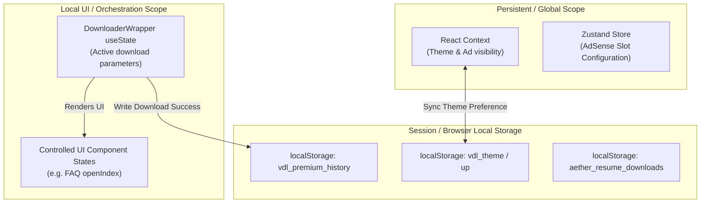

# STATE_MANAGEMENT.md — Aevnum

> ⚠️ This documentation must always reflect the current implementation. Whenever related code is added, removed, or modified, this document must be updated in the same pull request.

---

## State Management Overview

Aevnum utilizes a hybrid state management architecture tailored to its lightweight frontend profile. Rather than employing a single, all-encompassing global store, state is segregated by lifecycle, scope, and volatility.

---

## 1. React Context API (Global App State)

React Context is used for core application configurations that need to be read globally (e.g., Theme, layout modifiers based on ad presence).

**File**: [`context/AppContext.tsx`](../context/AppContext.tsx)

### Context Exports
- `AppProvider`: Wraps the entire application in [`app/layout.tsx`](../app/layout.tsx)
- `useTheme()`: Consumer hook returning `{ theme, isDark, toggleTheme, setShowStickyBottomAd, showStickyBottomAd }`
- `useBottomAd()`: Consumer hook returning `{ showStickyBottomAd, setShowStickyBottomAd }`

### AppContext State Details
1. **Theme state** (`theme`: `"light" | "dark"`):
   - Loaded on mount inside a `useLayoutEffect` to prevent server-side mismatch flashes.
   - Fallback checks system preference if `up` (user preference) key is absent in `localStorage`.
   - Action `toggleTheme` sets the local storage preferences and toggles the class list:
     - `localStorage.setItem("up", "1")`
     - `localStorage.setItem("vdl_theme", nextTheme)`
     - Syncs theme state with `document.documentElement.classList.add("dark")` or `.remove("dark")`.
2. **Sticky Bottom Ad State** (`showStickyBottomAd`: `boolean`):
   - Default: `true`
   - Governs the visibility of the bottom sticky ad across the layout.
   - When set to `false`, adjusts the padding offsets in components like [`components/sections/footer.tsx`](../components/sections/footer.tsx).

---

## 2. Zustand Store (AdSense Configurations)

Zustand is used for read-only static configuration injected at the root from environment variables, avoiding prop-drilling or large Context rerenders.

**File**: [`config/zustand/index.tsx`](../config/zustand/index.tsx)

### Store Values
- `adsenseClientId`: Injected from `process.env.NEXT_PUBLIC_ADSENSE_CLIENT_ID`
- `topBannerSlotId`: Injected from `process.env.NEXT_PUBLIC_TOP_BANNER_SLOT_ID`
- `sidebarSlotId`: Injected from `process.env.NEXT_PUBLIC_SIDEBAR_SLOT_ID`
- `bottomAnchorSlotId`: Injected from `process.env.NEXT_PUBLIC_BOTTOM_ANCHOR_SLOT_ID`
- `setAdConfig()`: Setter action (primarily for updates/overrides)

---

## 3. Local React State (Orchestration & UI)

The vast majority of the application's interactive state is held inside [`components/sections/downloader-wrapper.tsx`](../components/sections/downloader-wrapper.tsx). This wrapper acts as the state mediator for all atomic downloader components.

### DownloaderWrapper State Properties
- **Video Query State**: `videoUrl` (input control), `detectedPlatform` (inferred destination), `activePlatform` (UI filter selection)
- **API Status Flags**: `isLoading` (fetching metadata status), `progress` (artificial analytical step progress indicator)
- **Metadata Models**: `parsedVideo` (active video structure)
- **Unlock Session Models**: `activeFormatId` (current format clicked), `unlockCountdown` (timer value), `streamToken` (decrypted media access UUID)
- **Download Streams**: `isDownloadingStream` (active binary pull state), `streamProgress` (bytes downloaded vs total)
- **Notifications**: `notification` (temporary toast banner status)
- **History Cache**: `downloadHistory` (array of successfully parsed media info)

---

## 4. Local Storage / Persistence Schema

The application stores preference configurations and temporary operational history variables locally.

| Storage Key | Type | Data Format | Originating File | Purpose |
|-------------|------|-------------|------------------|---------|
| `up` | `localStorage` | `"1"` | `AppContext.tsx` | Boolean flag indicating explicit theme override. |
| `vdl_theme` | `localStorage` | `"light" \| "dark"` | `AppContext.tsx` | Persisted theme value. |
| `vdl_premium_history` | `localStorage` | `JSON Array` | `downloader-wrapper.tsx` | Cache of recently downloaded clips. |
| `aether_resume_downloads` | `localStorage` | `JSON Array` | `download-manager.ts` | List of incomplete/paused downloads to support resume. |

*Related files: [`context/AppContext.tsx`](../context/AppContext.tsx), [`config/zustand/index.tsx`](../config/zustand/index.tsx), [`components/sections/downloader-wrapper.tsx`](../components/sections/downloader-wrapper.tsx), [`lib/download-manager.ts`](../lib/download-manager.ts)*
